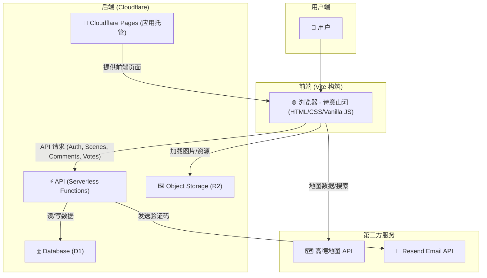

<h1 align="center">诗意山河</h1>
<p align="center">2025 年「零杯」网页设计大赛 · 方寸屏间，万里河山</p>

<p align="center">
  <a href="https://235800.xyz" target="_blank">
    
  </a>
</p>

<p align="center">
  <a href="https://github.com/Tranxc/China-travels" target="_blank">
    项目地址（GitHub）：https://github.com/Tranxc/China-travels
  </a>
  
</p>

---

## 1. 信息 🌐

- 作品名称: 诗意山河
- 比赛主题: 方寸屏间，万里河山

## 2. 项目简介 🗺️

“诗意山河”是一个集成了地理信息系统（GIS）与中国文化探索的交互式 Web 平台。我们响应大赛“方寸屏间，万里河山”的主题，旨在通过现代网页技术，将中国壮丽的自然风光与深厚的历史文化底蕴生动地展现在用户眼前。

本项目不仅仅是一个静态的展示页面，更是一个功能完备的动态 Web 应用。用户可以在交互式地图上探索中国各省份的著名景点，查看景点的详细图文介绍，并进行收藏、投票（喜欢/不喜欢）、发表评论、回复评论等一系列互动操作。

## 3. 项目亮点 🏆

- 🚀 具有后端：完整 Serverless 后端（Cloudflare Functions，位于 `/functions`）
  - 实现认证、景点数据查询、收藏、投票、评论（发表/点赞/举报/删除）等 API。
  
- 💾 具有数据库：Cloudflare D1 持久化存储（见 `schema.sql`）
  
- 🔄 前后端协作与动态网页：`/src/modules/api.js` 调后端 API，动态驱动站点内容
  
- 📱 响应式布局：原生 CSS 媒体查询覆盖 PC/平板/手机（见 `map.css`, `main.css`, `pages/scenic.html`）
  
- ✅ 高功能完成度：从“山河行吟”到“交互式地图”再到“景点详情与互动”的完整闭环
  
- 🎨 原创设计与用户体验：全部原生 CSS 设计，不使用现成 UI 库，统一且富有文化气质

## 4. 核心功能模块 ✨

- 📜 山河行吟（文化长廊页） — `src/components/culture-page.html`
  - 沉浸式全屏垂直滚动页面。通过滚动浏览代表中国山河的诗意场景，实现“一卷诗意”的视觉体验。

- 🧭 交互式地图（核心探索页） — 基于高德地图 JS API（见 `src/modules/map.js`）
  - 动态加载全国省份图层、省会标签，并高亮显示边界。
  - 高效搜索，支持输入省份或景点名称（如“故宫”）自动定位到相应省份。
  - 信息窗格（Info Panel）：点击省份标签，右侧弹出该省份的概览信息。
  - 景点抽屉（Detail Drawer）：点击“查看详情”，底部滑出该省份的著名景点轮播图。

- 🏞️ 景点详情页（独立景点页） — `pages/scenic.html`
  - 提供图片轮播、详细文字摘要。
  - 集成完整评论系统与互动功能。

- 🔐 完整的用户认证系统
  - 邮箱验证码：使用 Resend 服务发送邮箱验证码（`functions/services/email.js`）。
  - 注册与登录：新用户注册（昵称/密码）与密码登录（`functions/api/auth/`）。
  - 前端状态管理：`localStorage` + `src/modules/auth.js` 动态管理登录态与 UI。

- 💬 丰富的用户互动功能
  - 景点投票：对景点进行“喜欢/不喜欢”的投票（`functions/api/scene.js`）。
  - 景点收藏：登录用户可收藏并在个人中心查看（`functions/api/favorites.js`）。
  - 评论系统：发表评论、回复评论、点赞、举报、删除自己的评论（`functions/api/comment.js`）。

## 5. 技术栈与架构 💻

本项目采用前后端分离的现代 Web 架构，深度整合 Cloudflare 全栈服务。

- 前端
  - 构建工具：Vite
  - 核心技术：原生 JavaScript（ESM 模块化）、HTML5、CSS3
  - 地图服务：高德地图 JavaScript API

- 后端（Serverless）
  - 运行环境：Cloudflare Pages + Cloudflare Functions
  - API：通过 `/functions/api/` 下的 Serverless 函数提供 RESTful 接口
  - 数据库：Cloudflare D1（`schema.sql` 定义表结构，`wrangler.toml` 绑定）
  - 对象存储：Cloudflare R2（存储图片等资源，通过 `assets.235800.xyz` 访问）
  - 邮件服务：Resend API（发送注册验证码）

### 架构图（Mermaid）



### 数据库结构（Cloudflare D1）

- `users`：用户信息
- `scenes`：景点基础信息（由 `scripts/seed-scenes.js` 从 `scenes-data.js` 注入）
- `verification_codes`：邮箱验证码
- `favorites`：用户与景点收藏关联
- `scene_votes`：景点投票（喜欢/不喜欢）
- `comments`：评论内容（支持父子关系/回复）
- `comment_likes`：评论点赞
- `comment_reports`：评论举报

## 6. 使用的非自制库 🛠️

- 高德地图 JavaScript API：核心地图功能（图层、搜索、标记）
- Vite：前端开发与构建工具
- Resend（API 服务）：发送注册验证码邮件

> 说明：未使用任何预设样式的 UI 库（如 Bootstrap、ElementUI 等）；样式均为原生 CSS 编写。

## 7. 项目运行与部署 ⚙️

### 本地开发（前端）

```bash
npm install
npm run dev
```

### 本地开发（后端 / Functions）

1) 按 `wrangler.toml.example` 配置 `wrangler.toml`，并确保安装 Wrangler CLI。

2) 启动本地 Pages 开发（同时代理前端并运行 Functions）：

```bash
npx wrangler pages dev dist
```

### 数据（可选）

向本地 D1 数据库填充景点数据：

```bash
node scripts/seed-scenes.js
```

### 构建

```bash
npm run build
```

### 部署（Cloudflare Pages）

```bash
npx wrangler pages deploy dist
```

### 资源上传（可选，上传到 R2）

```bash
npm run upload:assets
```


## 7. 模块化文件分工概览

### 📁 项目文件结构
```
诗意山河/
├── index.html                     # 入口 HTML
├── src/
│   ├── main.js                    # 前端主入口
│   ├── config/assets.js           # 资源映射/常量
│   ├── data/                      # 地理/标注数据
│   │   ├── province-capitals.js
│   │   ├── province-taglines.js
│   │   └── provinces.js
│   ├── modules/                   # 前端功能模块
│   │   ├── map.js                 # 🗺️ 地图核心逻辑
│   │   ├── mapEvents.js           # 🗺️ 地图事件处理
│   │   ├── mapMain.js             # 🗺️ 地图页面组织/装配
│   │   ├── ui.js                  # 🎨 UI 状态与页面切换
│   │   ├── api.js                 # 🎨 前端 API 封装
│   │   ├── auth.js                # 🎨 前端认证状态管理
│   │   ├── scenic-page.js         # 🎨 景点详情页逻辑
│   │   └── scrollEffect.js        # 🎨 文化页滚动效果
│   ├── styles/                    # 样式文件
│   │   ├── main.css
│   │   ├── map.css
│   │   ├── pages.css
│   │   ├── auth.css
│   │   ├── culture.css
│   │   └── mountain.css
│   └── components/                # 页面/组件片段
│       ├── home-page.html
│       ├── culture-page.html
│       ├── auth-modal.html
│       ├── scene-drawer.html
│       ├── map.html
│       └── map-toolbar.html
├── pages/
│   └── scenic.html                # 景点详情页（独立页面）
└── functions/                     # 后端 Functions（文件即路由）
    ├── api/
    │   ├── auth/
    │   │   ├── complete-register.js
    │   │   ├── login.js
    │   │   ├── send-code.js
    │   │   └── verify.js
    │   ├── comment.js
    │   ├── favorites.js
    │   └── scene.js
    ├── services/
    │   ├── database.js
    │   └── email.js
    └── utils/
        └── auth.js
```

### 📋 文件分工表

| 文件/模块                            | 负责人   | 主要职责                     |
| ------------------------------------ | -------- | ---------------------------- |
| `index.html`                         | 全体     | 根页面/入口                  |
| `src/main.js`                        | 全体     | 前端主入口/集成              |
| `vite.config.js`                     | 全体     | Vite 配置                    |
| `src/modules/scenic-page.js`         | 全体     | 景点详情页逻辑（共同）       |
| `src/components/scene-drawer.html`   | 全体     | 轮播页面（抽屉）结构（共同） |
| `pages/scenic.html`                  | 全体     | 景点详情/轮播/评论页面（共同）|
| `src/modules/map.js`                 | 成员 A   | 地图初始化与核心逻辑         |
| `src/modules/mapEvents.js`           | 成员 A   | 地图交互事件处理             |
| `src/modules/mapMain.js`             | 成员 A   | 地图页面装配/组织            |
| `src/styles/map.css`                 | 成员 A   | 地图容器与控件样式           |
| `src/components/map.html`            | 成员 A   | 地图页面结构                 |
| `src/components/map-toolbar.html`    | 成员 A   | 地图工具栏结构               |
| `src/modules/ui.js`                  | 成员 B   | UI 状态管理与页面切换        |
| `src/modules/api.js`                 | 成员 B   | 前端 API 调用封装            |
| `src/modules/auth.js`                | 成员 B   | 前端登录态/鉴权状态          |
| `src/modules/scrollEffect.js`        | 成员 B   | 文化页滚动与动画             |
| `src/styles/main.css`                | 成员 B   | 全局基础样式                 |
| `src/styles/pages.css`               | 成员 B   | 页面布局与响应式             |
| `src/styles/auth.css`                | 成员 B   | 认证相关样式                 |
| `src/styles/culture.css`             | 成员 B   | 文化页样式                   |
| `src/styles/mountain.css`            | 成员 B   | 主题/装饰样式                |
| `src/components/home-page.html`      | 成员 B   | 首页结构                     |
| `src/components/culture-page.html`   | 成员 B   | 文化长廊页结构               |
| `src/components/auth-modal.html`     | 成员 B   | 登录/注册弹窗结构            |
| `functions/api/auth/complete-register.js` | 成员 C | 注册完成（设置昵称/密码）    |
| `functions/api/auth/login.js`        | 成员 C   | 用户登录                     |
| `functions/api/auth/send-code.js`    | 成员 C   | 发送邮箱验证码               |
| `functions/api/auth/verify.js`       | 成员 C   | 验证邮箱验证码               |
| `functions/api/scene.js`             | 成员 C   | 景点查询/详情/投票接口       |
| `functions/api/comment.js`           | 成员 C   | 评论发表/回复/点赞/举报/删改 |
| `functions/api/favorites.js`         | 成员 C   | 收藏增删查接口               |
| `functions/services/database.js`     | 成员 C   | D1 数据库访问封装            |
| `functions/services/email.js`        | 成员 C   | Resend 邮件服务封装          |
| `functions/utils/auth.js`            | 成员 C   | Token/鉴权工具               |
| `scripts/seed-scenes.js`             | 成员 C   | 景点数据导入脚本             |
| `scripts/scenes-data.js`             | 成员 C   | 景点数据源                   |
| `scripts/upload-assets.js`           | 成员 C   | 资源上传至 R2                |
| `schema.sql`                         | 成员 C   | 数据表结构定义               |
| `wrangler.toml`                      | 成员 C   | Cloudflare 绑定与本地配置    |

## 8. 补充说明（初赛）📝

- 项目状态：初赛提交版本。
- 已知问题：部分微小按键（如景点详情页轮播按钮、评论区点赞按钮等）在特定操作流程下偶发交互问题。后续将重点修复相关体验问题。
- 未来展望：计划优化地图性能、完善景点诗词文化数据，彻底解决已知交互 BUG，持续优化用户体验。
